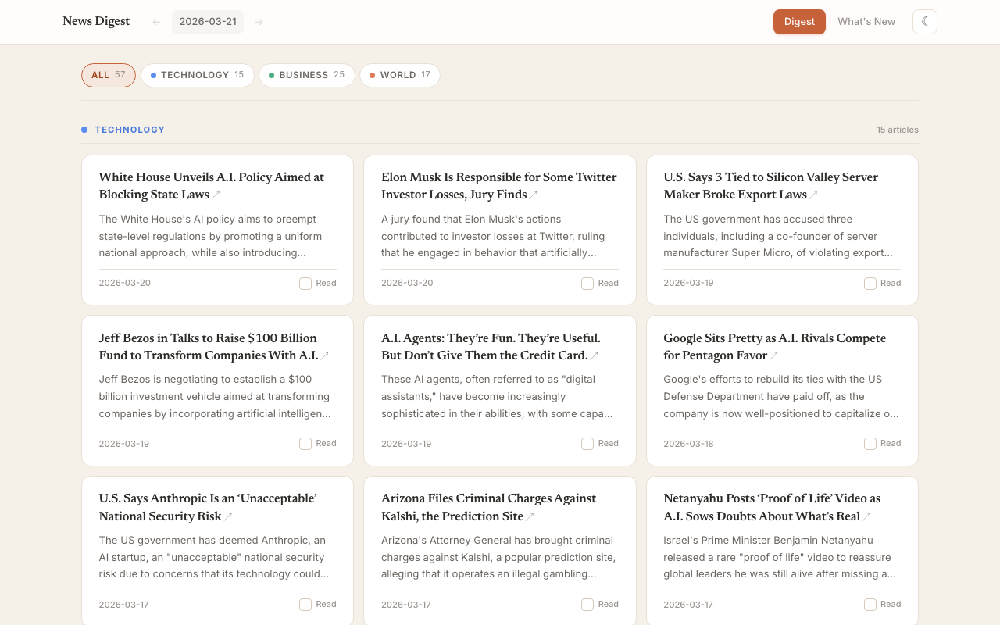
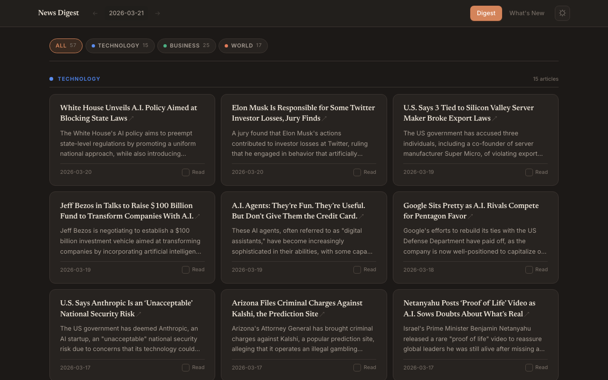
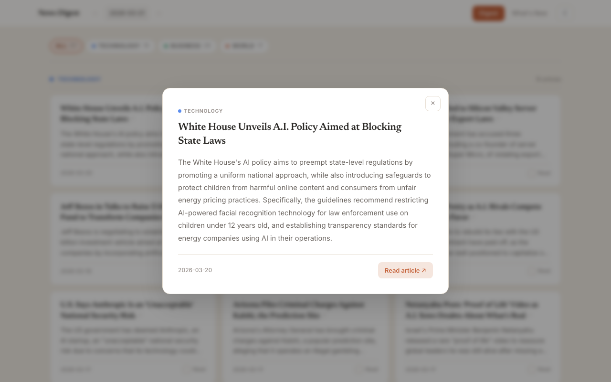

# News Digest

A local news digest tool that fetches NYT articles, summarizes them with Ollama (Llama 3), and shows only new information each day — a "news diff" for personal use. Includes a web UI for browsing digests.



<details>
<summary>Dark mode & article modal</summary>




</details>

## Setup

1. Install dependencies:
   ```bash
   git clone https://github.com/srimanokaran/news-digest.git
   cd news-digest
   python3 -m venv .venv
   source .venv/bin/activate
   pip install requests python-dotenv
   ```

2. Add your NYT API key:
   ```bash
   cp .env.example .env
   # Edit .env with your key from https://developer.nytimes.com
   ```

3. Install and run Ollama with Llama 3:
   ```bash
   ollama pull llama3
   export OLLAMA_NUM_PARALLEL=4
   ollama serve
   ```

## Usage

```bash
python digest.py
```

Output goes to `output/YYYY-MM-DD.md`. Run it again the next day and it diffs against the previous day's summaries to surface only new information.

### Web UI

```bash
pip install flask markdown
python app.py
# Open http://localhost:5050
```

Features: section filtering, read tracking, dark mode, article modal with full summaries.

## Benchmark

Compare sequential vs parallel summarization:

```bash
python benchmark.py
```

## Configuration

Edit `config.py` to change:
- Sections to follow (default: technology, business, world, opinion)
- Keywords to filter articles per section
- Ollama model and parallel workers
